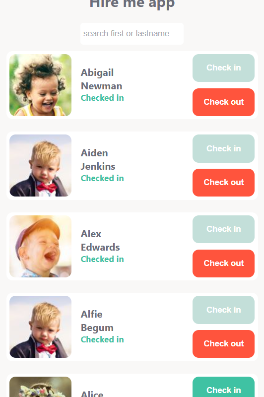

# How to setup the project

- open a terminal in the subfolder named "famly-client".
- type in "npm install" to get all the dependencies of the project
- type in "npm start" to start the application
- a browser should open to http://localhost:3000/

# Design choices

My first design choice was to make the application easy to use with a single finger on a mobile phone or tablet.

This is why I chose the vertical list layout for mobile and a grid list for tablet.

For the interactions I first chose to have 2 buttons with different colors to check in and check out children. However, due to the colors of the buttons and the current status of the children, I thought it was counter intuitive. The red check out button would be active while the children has a green status of "Checked in". I wanted to make the colors match better the current status of the child.



I then chose to modify the buttons. Instead of having 2 buttons, I chose to have a single slider to check in or out children. The slider has a green color when the child is checked in and it turns red when the child is checked out. This way the user has a consistency between the button color and the current status.
I also chose to gray out the picture of the child when he is not checked in for better clarity.

I added a search field to browse through the children list more easily. It allows the user to search for a specific child using a firs name or last name.

# Interested in working for Famly?

Give us a chance to see your beautiful code! 🤩 

How to get started:
- Fork this repository
- Create a small application in React (or another agreed upon framework)
- Describe your design decisions and setup instructions in the README.md of the forked repository

The application should be able to do 3 things:
1. List children
2. Checkin a child
3. Checkout a child

There are no other requirements than that—don't worry about design or anything like that.

If you have any questions feel free to reach out to ckl@famly.co (Christian) ☺️

## API Specification

Use this access token: `234ffdb8-0889-4be3-b096-97ab1679752c`

### Fetch some children from
```
GET https://tryfamly.co/api/daycare/tablet/group
Arguments: {
	accessToken: <accessToken>,
	groupId: '11fc220c-ebba-4e55-9346-cd1eed714620',
	institutionId: 'fb6c8114-387e-4051-8cf7-4e388a77b673'
}
```

Example in cURL:

```bash
$ curl "https://tryfamly.co/api/daycare/tablet/group?accessToken=234ffdb8-0889-4be3-b096-97ab1679752c&groupId=11fc220c-ebba-4e55-9346-cd1eed714620&institutionId=fb6c8114-387e-4051-8cf7-4e388a77b673"
```

### Checkin child
```
POST https://tryfamly.co/api/v2/children/<childId>/checkins

Arguments: {
	accessToken: <accessToken>
	pickupTime: 16:00
}
```

Example in cURL:

```bash
$ curl \
  -d 'accessToken=234ffdb8-0889-4be3-b096-97ab1679752c&pickupTime=16:00' \
  https://tryfamly.co/api/v2/children/fcd683d0-bc31-468c-948f-1ca70b91439d/checkins
```

### Checkout child
```
POST https://tryfamly.co/api/v2/children/<childId>/checkout
Arguments: {
	accessToken: <accessToken>
}
```

Example in cURL:

```bash
$ curl \
  -d 'accessToken=234ffdb8-0889-4be3-b096-97ab1679752c' \
  https://tryfamly.co/api/v2/children/fcd683d0-bc31-468c-948f-1ca70b91439d/checkout
```
